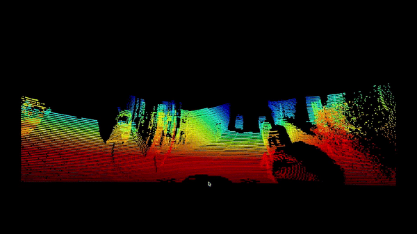

# 📡 Cost-Efficient LiDAR 3D Scanning System

## 📌 Project Overview
This repository contains the embedded firmware and visualization software for a **Cost-Efficient 3D LiDAR Scanner**. The system utilizes a Garmin LiDAR-Lite v3 sensor paired with an Arduino Mega to capture high-precision distance measurements. The hardware sweeps the environment using a custom pan-tilt mechanism, capturing spatial data and transmitting it to a PC via serial communication.

A custom Java application written in **Processing IDE** receives this telemetry, converts the spherical coordinates (yaw, pitch, distance) into Cartesian coordinates (X, Y, Z), and renders a live **3D Point Cloud** of the scanned environment.

*🏆 This project was officially supported and funded by the **TÜBİTAK 2209-A** Research Project Support Programme for Undergraduate Students.*

---

## 📷 System Demonstration
*(Note to Ömer: Replace these placeholder links with actual images or a GIF of your project!)*

| Hardware Setup | 3D Point Cloud Render |
| :---: | :---: |
|  |  |

---

## ⚙️ System Architecture

### 1. Hardware Layer (Embedded C++)
* **Microcontroller:** Arduino Mega 2560
* **Sensor:** Garmin LiDAR-Lite v3
* **Actuators:** 2x Pan-Tilt Servo Motors 
* **Communication:** `I2C` (for LiDAR-to-MCU), `UART/Serial` (for MCU-to-PC)

**Embedded Workflow:**
1. The Arduino Mega commands the pan/tilt servos to move in a grid pattern.
2. At each step, the MCU requests a distance measurement from the LiDAR via the `I2C` bus.
3. The MCU packages the current `[Pan Angle, Tilt Angle, Distance]` and streams it asynchronously to the PC over `UART`.

### 2. Visualization Layer (Java / Processing IDE)
* **Environment:** Processing 3/4
* **Math Logic:** Applies trigonometric transformations to convert incoming spherical data into an actionable 3D Cartesian space.
  * `X = distance * sin(tilt) * cos(pan)`
  * `Y = distance * sin(tilt) * sin(pan)`
  * `Z = distance * cos(tilt)`
* **Rendering:** Utilizes OpenGL (P3D) to plot points in real-time, allowing the user to rotate and inspect the 3D map.

---

## 🔌 Hardware Wiring Guide

| LiDAR-Lite v3 Pin | Arduino Mega Pin | Description |
| :--- | :--- | :--- |
| 5V (Red) | 5V | Power supply |
| GND (Black) | GND | Ground |
| SCL (Green) | Pin 21 (SCL) | I2C Clock |
| SDA (Blue) | Pin 20 (SDA) | I2C Data |

*Note: A 680µF capacitor is recommended across the 5V and GND lines of the LiDAR to absorb voltage spikes during measurement bursts.*

---

## 🚀 How to Run the Project

### 1. Flash the MCU
1. Open `Arduino_Firmware/LiDAR_Scanner.ino` in the Arduino IDE.
2. Install the necessary libraries (`Wire.h`, `Servo.h`, and the `LIDARLite` library).
3. Connect your Arduino Mega and click **Upload**.

### 2. Launch the 3D Visualizer
1. Open `Processing_Visualizer/PointCloudRender.pde` in the Processing IDE.
2. Ensure your Arduino is connected to the PC via USB.
3. Update the `Serial.list()[X]` index in the Processing code to match your Arduino's COM port.
4. Click **Run** to start the real-time 3D scan rendering.

---

### 🎥 Watch the Project Demo on YouTube

---
*Developed by [Ömer Faruk Öncel](https://github.com/M3Rcrypt).*
